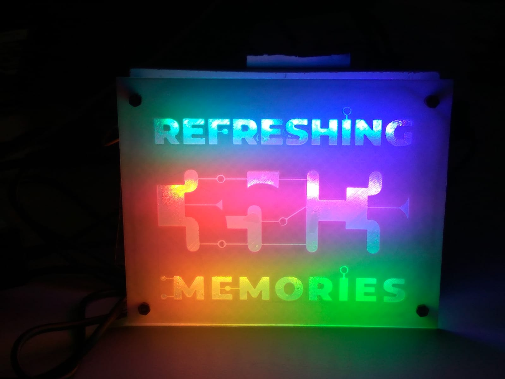

# 35c3-led-logo
3D printed Neopixel 35c3 logo 

## part lists

* 6 x Neopixel sticks (with 8 neopixel each)
* Arduino Nano
* 3D printed logo
* 180x150x3mm HDF 
* 4 x M3 30mm standoff, 4 x M3 nuts, 4 x M3x10 screws

# software used

* Inkscape 
* Inkscape to OpenSCAD converter https://www.thingiverse.com/thing:25036
* OpenSCAD
* Arduino IDE
* Adafruit Neopixel Library

## logo design

* Loading the original 35c3 logo svg imageinto inkscape.
* Using svg2opencad plugin to create OPenSCAD file from SVG
* Create the logo STL file with OpenSCAD
* Scale it (if wanted) and print it with your 3D printer (0.2mm layer height, 30% infill)
